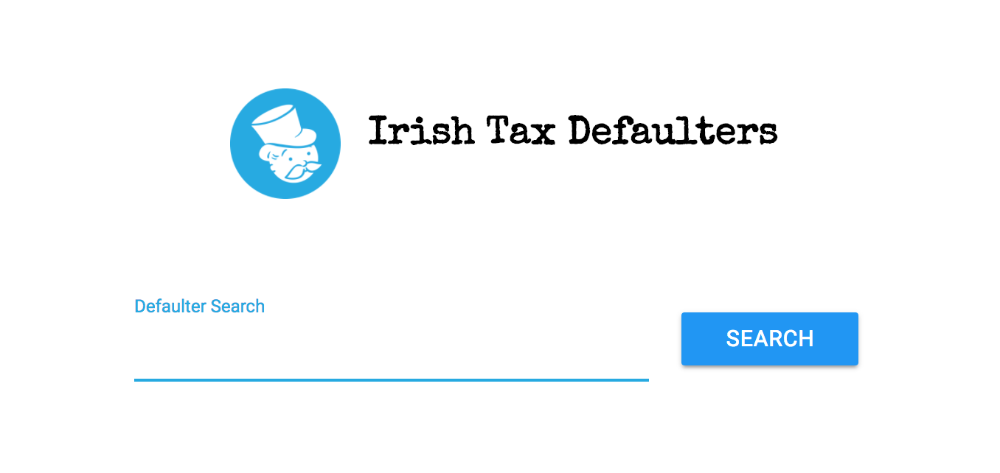

# IrishTaxDefaulters
A searchable analytics tool of the Irish Tax Defaulters data

## Data Download
This tool relies totally on the publicly accessible data from the Irish tax authorities web-site, 
and defaulters archive. The tool provides no guarantees for data correctness either in the input data
or after it has been parsed by the tool. This repo in itself does not hold any data, which must be 
downloaded separately. 

## How to run the dashboard
Basically there are three main steps, first clone down the repo, then run the data download/extractor script, 
and then execute the dashboard. 

<pre>
git clone <ssh-to-repo>
cd IrishTaxDefaulters
sh ./bin/download-data.sh

sudo apt-get install python-pip
virtualenv venv
. ./venv/bin/activate
pip install Flask

python src/DefaultersDashboard.py
</pre>

Then open a browser and go to the following URL

<pre>
http://127.0.0.1:1798/
</pre>
